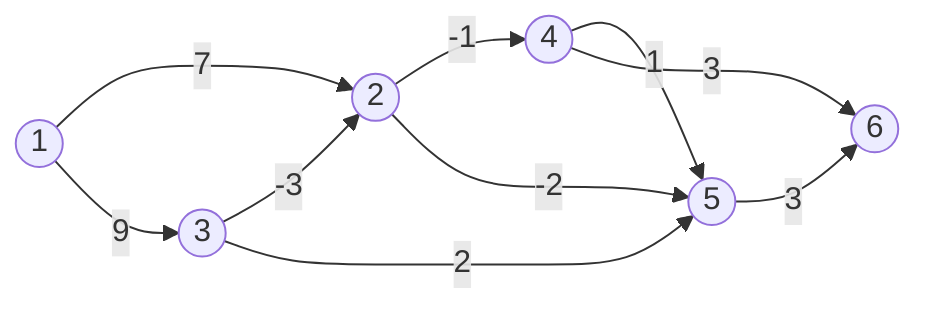

# Лабораторная работа №2.3. Алгоритмы поиска на графах.


## Варианты заданий:
Номер Вашего варианта такой крутой


## Реализация алгоритма Форда-Беллмана



### Ручная
<details>

  <summary>Фото</summary>
  
</details>

### Программный код


<details>
  <summary>main.py</summary>

```python
def bellman_ford_algorithm(graph, source, search_node=None):
    distance = {}
    predecessor = {}
    for node in graph:
        distance[node] = float('inf')
        predecessor[node] = None
    distance[source] = 0

    for _ in range(len(graph) - 1):
        for node in graph:
            for neighbour in graph[node]:
                new_distance = distance[node] + graph[node][neighbour]
                if new_distance < distance[neighbour]:
                    distance[neighbour] = new_distance
                    predecessor[neighbour] = node

    for node in graph:
        for neighbour in graph[node]:
            assert distance[node] + graph[node][neighbour] >= distance[neighbour]

    if search_node is not None:
        path = []
        node = search_node
        while node is not None:
            path.insert(0, node)
            node = predecessor[node]
        if distance[search_node] != float('inf'):
            return distance[search_node], path, distance

    return None, None, distance


graph = {
    '1': {'2': 7, '3': 9},
    '2': {'4': -1, '5': -2},
    '3': {'2': -3, '5': 2},
    '4': {'5': 1, '6': 3},
    '5': {'6': 3},
    '6': {},
}

distance, path, all_distance = bellman_ford_algorithm(graph, source='1', search_node='6')
print(distance)
print(path)
print(all_distance)
  
```
 
### Вывод:
```bash
7
['1', '3', '2', '5', '6']
{'1': 0, '2': 6, '3': 9, '4': 5, '5': 4, '6': 7}
```

</details>
